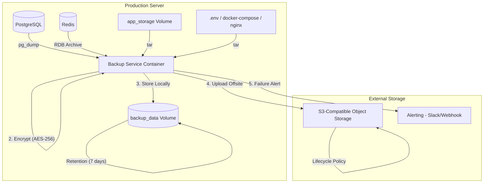

# Backup Architecture Diagram

```mermaid
graph TD
    subgraph "Production Server"
        DB[(PostgreSQL)]
        FS[app_storage Volume]
        REDIS[(Redis)]
        CFG[.env / docker-compose / nginx]

        BKP_SRV[Backup Service Container]

        BKP_VOL[(backup_data Volume)]
    end

    subgraph "External Storage"
        S3[S3-Compatible Object Storage]
        Slack[Alerting - Slack/Webhook]
    end

    DB -- "pg_dump" --> BKP_SRV
    REDIS -- "RDB Archive" --> BKP_SRV
    FS -- "tar" --> BKP_SRV
    CFG -- "tar" --> BKP_SRV

    BKP_SRV -- "1. Archive" --> BKP_SRV
    BKP_SRV -- "2. Encrypt (AES-256)" --> BKP_SRV
    BKP_SRV -- "3. Store Locally" --> BKP_VOL
    BKP_SRV -- "4. Upload Offsite" --> S3
    BKP_SRV -- "5. Failure Alert" --> Slack

    BKP_VOL -- "Retention (7 days)" --> BKP_VOL
    S3 -- "Lifecycle Policy" --> S3
```
